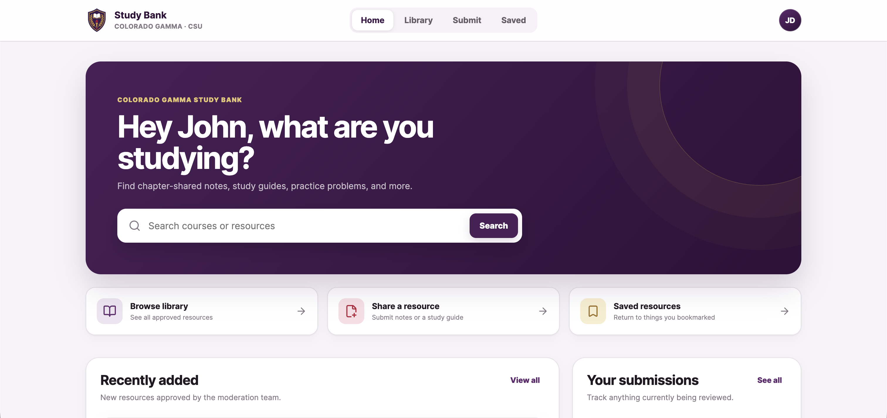
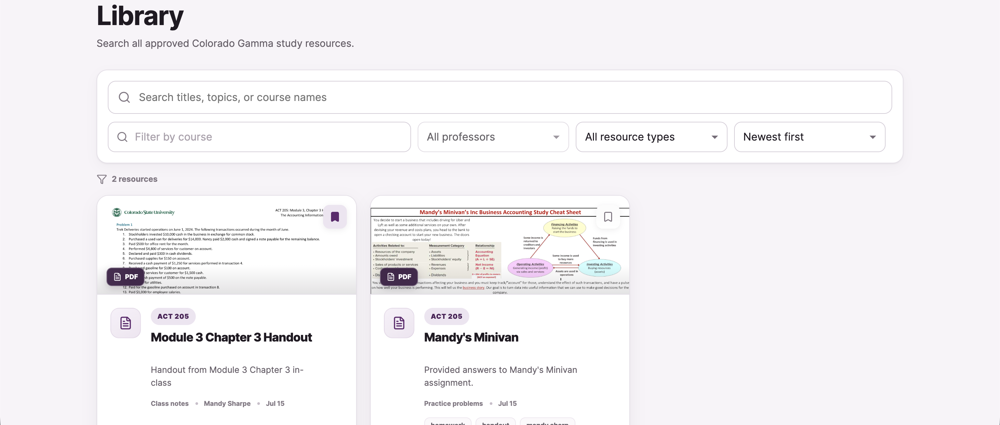
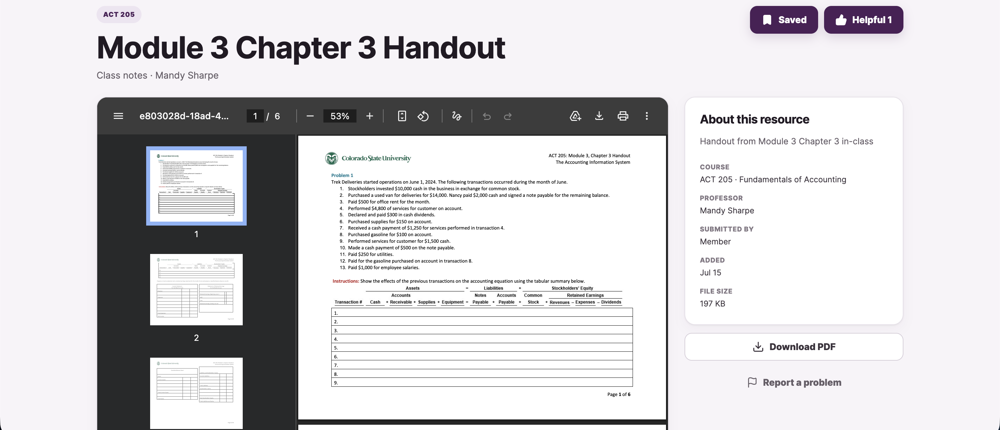
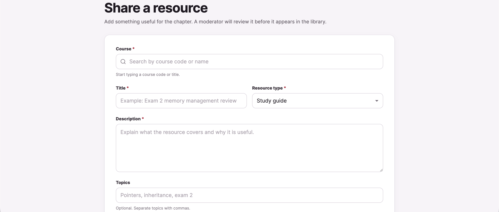
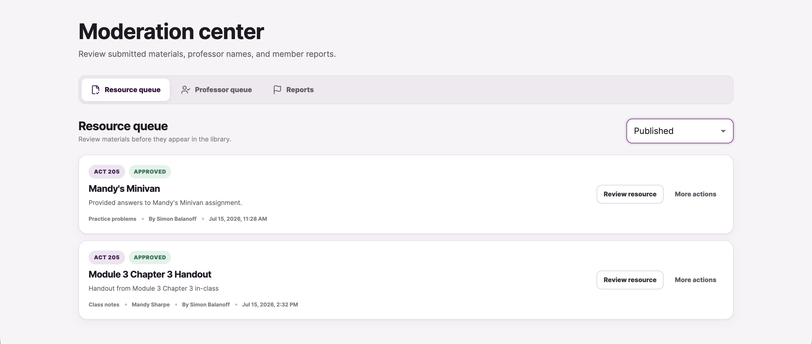

<div align="center">
  
  
  # Colorado Gamma Study Bank

  An invite-only academic resource platform for Sigma Phi Epsilon's Colorado Gamma chapter.

  [View the live site](https://sig-ep-study.vercel.app)
</div>

<p align="center">
  
  
  
  
  
</p>

<p align="center">
  
</p>

## Overview

Colorado Gamma Study Bank gives chapter members one secure place to upload, discover, preview, save, and manage academic resources. The platform is organized around courses and professors, with invitation-based registration and role-specific moderation tools.

## Features

- Search and filter resources by course, professor, type, topic, and relevance
- Upload PDFs and generate first-page preview images automatically
- Store private files and previews in Cloudflare R2
- Save useful resources and mark submissions as helpful
- Track personal submissions and moderation status
- Invite-only registration with secure cookie-based sessions
- Moderator review queue with approval and revision workflows
- Administrative tools for users, invitations, roles, and audit history
- Responsive interface for desktop and mobile use

## Screenshots

<table>
  <tr>
    <td width="50%">
      
    </td>
    <td width="50%">
      
    </td>
  </tr>
  <tr>
    <td align="center"><strong>Resource library</strong></td>
    <td align="center"><strong>Resource preview</strong></td>
  </tr>
  <tr>
    <td width="50%">
      
    </td>
    <td width="50%">
      
    </td>
  </tr>
  <tr>
    <td align="center"><strong>Resource submission</strong></td>
    <td align="center"><strong>Moderation workflow</strong></td>
  </tr>
</table>

## Architecture

```text
React + Vite client
        |
        | HTTPS / authenticated API requests
        v
Express + TypeScript API
        |
        +---- MongoDB Atlas
        |       users, sessions, courses, resources, invitations
        |
        +---- Cloudflare R2
                private PDFs and generated preview images
```

The frontend is deployed on Vercel, the API is hosted on Render, MongoDB Atlas stores application data, and Cloudflare R2 stores uploaded documents.

## Technology

| Area | Technologies |
| --- | --- |
| Frontend | React, TypeScript, Vite, React Router, TanStack Query |
| Forms and validation | React Hook Form, Zod |
| Backend | Node.js, Express, TypeScript |
| Authentication | Signed HTTP-only cookies, persisted sessions, role-based authorization |
| Database | MongoDB Atlas, Mongoose |
| File storage | Cloudflare R2 |
| Deployment | Vercel, Render |

## Access model

The platform is intentionally invite-only. Members can browse and submit resources, moderators can review submissions, and administrators can manage accounts, invitations, and chapter-wide settings.

Uploaded PDFs remain private and are served only through authenticated API routes.

## Author

Built by [Simon Balanoff](https://github.com/simonbalanoff).
